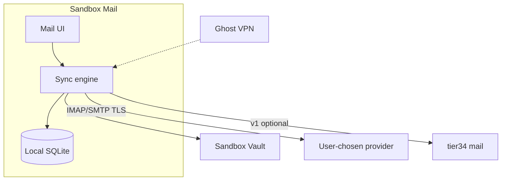

# Built-in Mail — native client, sovereign inbox

**Last updated:** 2026-07-12  
**Status:** Architecture only — no implementation  
**Stations doc:** [STATIONS-ARCHITECTURE.md](../sandbox-os-core/docs/STATIONS-ARCHITECTURE.md) (Mail section)

## Purpose

Sandbox OS ships a **first-party email client station** — read, compose, search, and notify — connected to mailboxes the user controls. Default posture: **no Gmail surveillance**, no Proton Mail wrapper, no webmail tab dressed as an app.

**Phased truth:** v0 is a **capable IMAP/SMTP client** (like a sovereign Thunderbird). Optional **tier34 mail server** in v1+ gives households a self-hosted `@home` address without Google or Microsoft.

---

## What we build

| Layer | Choice |
|-------|--------|
| **Client** | **Sandbox Mail** — native station (`sandbox-mail` Tauri or shell SPA + Rust mail core) |
| **Protocols** | IMAP (read/sync), SMTP (send), optional JMAP later |
| **Auth** | App passwords, OAuth where provider requires — stored in **Sandbox Vault**, not Mail localStorage |
| **Encryption** | TLS to server; **E2E** (OpenPGP / autocrypt) where peers support; S/MIME optional v2 |
| **Server (optional)** | tier34 **mail module** — Postfix/Dovecot or lightweight Rust stack — v1+ |
| **Not shipping** | Proton Mail bridge wrapper, Gmail WebView, “sign in with Google” as default |

Same philosophy as VPN (native WireGuard) and Browser (native Tide): **first-party UX, household keys, no vendor silo**.

---

## Architecture

```text
┌─────────────────────────────────────────────────────────────┐
│  Sandbox Mail station (sandbox-mail)                         │
│  Inbox · threads · compose · search · attachments            │
├─────────────────────────────────────────────────────────────┤
│  Mail sync engine (Rust)                                     │
│  idle IMAP · local cache (SQLite) · outbox queue             │
├─────────────────────────────────────────────────────────────┤
│  Sandbox Vault — credentials, PGP keys                       │
├─────────────────────────────────────────────────────────────┤
│  Ghost overlay (optional) — IMAP/SMTP via Home/Circle        │
└─────────────────────────────────────────────────────────────┘
         │ TLS                    │ TLS (v1+)
         ▼                        ▼
   External IMAP/SMTP        tier34 mail module
   (any provider user        (@household sandbox.local
    chooses)                   or custom domain)
```



---

## Client scope (v0 target)

| Feature | v0 | v1 | v2 |
|---------|----|----|-----|
| Multiple accounts | ✓ | ✓ | ✓ |
| Unified inbox | ✓ | ✓ | ✓ |
| Thread view | ✓ | ✓ | ✓ |
| Compose / reply / forward | ✓ | ✓ | ✓ |
| Attachments (open via Files) | ✓ | ✓ | ✓ |
| Local search (cached headers/bodies) | ✓ | ✓ | ✓ |
| Push / idle (IMAP IDLE) | partial | ✓ | ✓ |
| OpenPGP sign/encrypt (Autocrypt) | — | ✓ | ✓ |
| tier34 `@home` mailbox | — | ✓ | ✓ |
| Calendar/contacts bridge | — | — | optional |

**Mobile + desktop:** same station id, same account list synced via tier34 **mail-accounts blob** (encrypted — account metadata only; secrets in Vault).

---

## Sovereign mail on tier34 (optional server — v1+)

Households that want **no external mail provider**:

| Piece | Role |
|-------|------|
| **Inbound** | MX to household (port forward or VPS relay → tier34) |
| **Storage** | Maildir or SQLite per user on tier34 disk |
| **Auth** | Household identity — same keys as OS join |
| **E2E** | OpenPGP default for `@household` addresses; plain SMTP only to external domains |
| **Federation** | Not ActivityPub — standard SMTP between households |

**Honest scope:** running mail on a Pi is **operationally heavy** (SPF, DKIM, DMARC, abuse, deliverability). v0 **does not require** self-host. v1 documents the module; v2 makes one-click tier34 mail a guided setup (DNS wizard, relay option).

---

## Comparison — Proton / Gmail vs Sandbox Mail

| | Gmail (default world) | Proton Mail | Sandbox Mail |
|---|----------------------|-------------|--------------|
| **Client** | Web/app with Google account | Proton app / bridge | **Native OS station** |
| **Surveillance** | Content scanning, ads graph | Proton policy; trust vendor | **Your client; your server choice** |
| **Identity** | Google account | Proton account | **OS household keys** |
| **Self-host** | No | Limited / bridge | **tier34 optional** |
| **E2E** | No | Proton-to-Proton | OpenPGP / Autocrypt (v1) |
| **Vault** | Google password | Proton login | **Sandbox Vault** for all creds |

**Better for Sandbox users:** one launcher, credentials in Vault, traffic optionally over Ghost overlay, no default path through Alphabet or Proton AG.

---

## Security and privacy defaults

1. **No Gmail as default wizard** — setup offers “add any IMAP account,” “use household mail (tier34),” or import provider URL.  
2. **Remote images** — blocked by default (privacy).  
3. **Link warnings** — plain HTTP and punycode highlight.  
4. **Credentials** — only Vault; Mail requests unlock per session.  
5. **Local cache** — encrypted at rest with device key (same as Vault envelope).  
6. **Notifications** — OS notification daemon; no third-party push SDK.  
7. **Ghost overlay** — when Home/Circle active, IMAP/SMTP use tunnel (Settings → Network).

---

## Phases

### v0 — Client UI + IMAP/SMTP

- **Sandbox Mail** station stub in catalog; dev SPA or Tauri shell.
- Add account flow → Vault stores password/OAuth token.
- Sync: headers + bodies to local SQLite; outbox queue for offline send.
- Compose, reply, attachment pick from Files station.
- Launch model: `spawn` — `sandbox-mail` binary or dev URL.
- **No tier34 mail server** — external providers only.

### v1 — E2E + tier34 mail module (optional)

- OpenPGP / Autocrypt: encrypt to contacts with keys.
- tier34 mail module spec + compose stack (receive/send for `@household`).
- Account list + PGP public keys sync via tier34 encrypted blobs.
- Tide “mailto:” hands off to Mail station.

### v2 — Hardening + household polish

- S/MIME for org mailboxes.
- Spam training local-only (no cloud ML).
- Multi-user household inboxes on one tier34.
- Import from Thunderbird / mbox.
- Calendar RSVP read-only (optional; not full calendaring station).

---

## Engineering map

| Piece | Location | Notes |
|-------|----------|-------|
| `sandbox-mail` UI | sandbox-os-core `stations/mail/` (future) | Tauri; sovereign design tokens |
| Mail sync core | Rust crate `sandbox-mail-sync` (future) | async-imap, lettre |
| Vault bridge | sandbox-os-core | `getCredential`, `storeOAuth` |
| tier34 routes | tier34-server (v1) | `/api/mail/*` module — optional |
| catalog | `shell/stations/catalog.json` | `id: mail` stub today |

**Large engineering:** full mail is years of edge cases (MIME, charset, Exchange quirks). v0 targets **honest IMAP** for standard providers; Exchange ActiveSync is out of scope unless contributed later.

---

## Relation to other stations

| Station | Interaction |
|---------|-------------|
| **Vault** | All mail passwords and PGP private keys |
| **Network / Ghost** | Tunnel IMAP/SMTP when away from home LAN |
| **Files** | Attachment save/open |
| **Social** | Not merged — Mail is async; Social is realtime |
| **THE TIDE** | `mailto:` handler registers to Mail |

---

## Open questions

1. JMAP vs IMAP-first for modern providers?  
2. tier34 mail: full Postfix stack vs lightweight relay-only?  
3. Default provider suggestions in onboarding (Fastmail, mailbox.org) without endorsement lock-in?  
4. Mobile: shared Rust core via Tauri mobile vs separate Kotlin mail stack?  
5. Push on iOS/Android without FCM/Google — IMAP IDLE + background policy only?

---

## See also

- [BUILT-IN-VPN.md](./BUILT-IN-VPN.md) — Ghost overlay for mail traffic  
- [VAULT-PASSWORDS.md](./VAULT-PASSWORDS.md) — credential storage  
- [BUILT-IN-PLATFORM.md](./BUILT-IN-PLATFORM.md) — stations not surveillance store  
- [MUSIC-CONSOLE-LINK.md](./MUSIC-CONSOLE-LINK.md) — pattern for shipping a full station from existing repo
