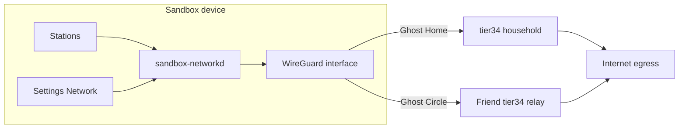

# Built-in VPN — native WireGuard, not a Proton wrapper

**Last updated:** 2026-07-12  
**Status:** Architecture only — no implementation  
**Overlay context:** [NETWORK-OVERLAY-GHOST.md](./NETWORK-OVERLAY-GHOST.md)  
**Stations doc:** [STATIONS-ARCHITECTURE.md](../sandbox-os-core/docs/STATIONS-ARCHITECTURE.md) (Network / Ghost section)

## Purpose

Sandbox OS ships a **first-party network overlay** — kernel-level tunnels, household keys, one settings UX on phone and desktop. Users get Proton/Mullvad-class privacy **without** installing a third-party VPN app, account, or telemetry SDK.

**Not in scope:** wrapping Proton VPN, Mullvad GUI, or any commercial VPN APK inside a WebView/Tauri shell. Same philosophy as THE TIDE (native browser, not Firefox telemetry) and Sandbox Mail (native client, not Gmail).

---

## What we build

| Layer | Choice |
|-------|--------|
| **Tunnel** | **WireGuard** — kernel module (`wireguard` / `wg-quick`) on Linux; platform WG on mobile when available |
| **Control plane** | tier34 + household keys — peer configs, DNS, split-tunnel rules |
| **UI** | **Settings → Network** + optional **Network** station in launcher — Ghost modes, status, peer list |
| **DNS** | Encrypted DNS (DoH/DoT) default on when overlay active |
| **Relation to Ghost** | VPN **is** the transport for Ghost: Home / Circle / Max — not a separate product |

Ghost overlay (split streams, padding, decoy profile) rides **on top of** WireGuard. v0 ships tunnel + modes; advanced tactics from [NETWORK-OVERLAY-GHOST.md](./NETWORK-OVERLAY-GHOST.md) land in later phases.

---

## Architecture

```text
┌─────────────────────────────────────────────────────────────┐
│  Stations (Tide, Social, Mail, Media)                        │
│  per-station split-tunnel profiles (v1+)                     │
├─────────────────────────────────────────────────────────────┤
│  Ghost UI — Settings → Network                               │
│  Off | Home | Circle | Max | Ghost Profile (Light/Full)      │
├─────────────────────────────────────────────────────────────┤
│  sandbox-networkd (user service)                             │
│  wg-quick / NetworkManager WG / mobile WG API                │
│  config from tier34 or local household bundle                  │
├─────────────────────────────────────────────────────────────┤
│  Linux kernel WireGuard                                      │
├─────────────────────────────────────────────────────────────┤
│  Wi‑Fi / 4G/5G / ISP — their air (reused)                    │
└─────────────────────────────────────────────────────────────┘
```



---

## Ghost modes (same UX everywhere)

Users never pick “exit node in Romania.” One control surface on **desktop, phone, and Pi**:

| Mode | Meaning | Wire path |
|------|---------|-----------|
| **Off** | Direct — fastest; ISP/carrier see destinations | No tunnel |
| **Home** | All (or default) traffic via **home tier34** | WG peer = household server |
| **Circle** | Route via **web-of-trust** relays (friends’ tier34 / Hydra heads) | WG multihop or relay chain |
| **Max** | Home/Circle + multipath + padding + jitter (when built) | Strongest; slower |
| **Ghost Profile** | Decoy persona on bait lane (orthogonal to tunnel) | See overlay doc |

**Mobile + desktop parity:** identical labels, identical behaviour, configs synced via tier34 encrypted network profile blob (same household identity as Vault/Mail).

Progress UI: “Finding a path…” — not ASN lists.

---

## Comparison — third-party vs sovereign

| | Proton / Mullvad (third-party) | Self-hosted WireGuard (tier34) | Hydra mesh (Circle) |
|---|-------------------------------|--------------------------------|---------------------|
| **Trust** | Trust vendor + their apps | Trust **your** household node | Trust **friends** in web-of-trust |
| **Account** | Vendor login | OS household keys | Federated peer grants |
| **Telemetry** | Vendor policy (varies) | **None** — OS component | None — peer protocol |
| **Egress IP** | Vendor POP | Your home / VPS IP | Friend relay IP |
| **Multihop** | Paid feature | DIY second hop (Circle) | Native design target |
| **Legal/abuse** | Vendor handles | **You** operate home node | Relay operators in circle |
| **Sandbox fit** | Wrapper = surveillance surface | **Default Ghost: Home** | **Ghost: Circle / Max** |

**Honest limits:** WireGuard does not make you invisible to nation-states or erase “SIM attached to tower.” Goal: **no OS-level spy**, **no third-party VPN vendor**, **commercial harvest impractical** — aligned with [BUILT-IN-PLATFORM.md](./BUILT-IN-PLATFORM.md).

**When third-party might still be used:** user explicitly sideloads Mullvad/Proton as **optional** station — not shipped, not default, not integrated with household keys.

---

## Components (engineering map)

| Piece | Repo / path | Role |
|-------|-------------|------|
| `sandbox-networkd` | sandbox-os-core (future) | Apply WG configs, health, reconnect, DNS |
| Network settings UI | shell Settings panel + `stations/network/` | Ghost toggles, status, bandwidth cap |
| tier34 `network` API | tier34-server (future) | Store encrypted peer configs, relay roster |
| WG keys | Household identity — same root as Vault | No separate “VPN account” |
| Tide / stations | Optional per-app profiles (v1) | Social vs browse vs mail on different paths |
| ISO | `wireguard-tools`, kernel module | Preinstalled; no snap Flatpak VPN |

---

## Phases

### v0 — WireGuard to home tier34

- Kernel/module + `wg-quick` (or NetworkManager plugin) on Sandbox OS images.
- **Ghost: Home** — single peer = household tier34 public endpoint (or DDNS).
- **Ghost: Off** — explicit direct mode.
- Settings → Network: toggle, connection status, last handshake, data used.
- Encrypted DNS default when tunnel up.
- tier34 exposes minimal endpoint: UDP port, server public key, allowed IPs — distributed via QR / household join flow.
- **No** Circle, **no** Ghost Profile, **no** multihop.

**Deliverable:** spec + `catalog.json` stub + Settings panel mock — not full ISO integration in this pass.

### v1 — Circle, split tunnel, station profiles

- **Ghost: Circle** — second hop via friend tier34 (web-of-trust ACL on tier34).
- Split tunnel: “Sandbox stations only” vs “full device” (mobile data saver).
- Per-station routing hooks (Tide uses overlay; LAN printer stays local).
- **Ghost Profile: Light** — decoy DNS + padding on bait namespace ([NETWORK-OVERLAY-GHOST.md](./NETWORK-OVERLAY-GHOST.md)).
- Mobile: same UI; WG via platform API (Android/Linux phone builds).
- Config sync: encrypted network profile blob on tier34.

### v2 — Max, Hydra supply, hardening

- **Ghost: Max** — multipath (Wi‑Fi + cellular), padding, jitter.
- Opt-in phone relay when charging (Hydra head as Circle peer).
- **Ghost Profile: Full** — scheduled synthetic persona traffic.
- Kill switch, leak tests in Settings, captive-portal helper.
- Audit: no traffic outside tunnel when mode ≠ Off (except explicit LAN bypass).

---

## Integration with other stations

| Station | VPN interaction |
|---------|-----------------|
| **THE TIDE** | Sovereign proxy + Ghost egress; optional “browse only via overlay” |
| **Mail** | IMAP/SMTP over tunnel when Home/Circle active; cert pinning |
| **Media** | LAN DLNA local; streaming egress via overlay if user chooses |
| **Vault** | Sync over tier34 — prefer LAN, overlay when away |
| **Social / Messages** | E2E payloads; overlay hides metadata from ISP |

---

## What we are **not** doing

| Anti-pattern | Why |
|--------------|-----|
| Proton VPN APK in WebView | Third-party telemetry, separate login, not sovereign |
| “Install OpenVPN Connect” | Legacy, heavy, not household-keyed |
| Central Sandbox VPN SaaS | Becomes surveillance ledger — contradicts platform |
| Promise “untrackable” | Dishonest — see threat model in overlay doc |

---

## Open questions

1. Default Ghost mode on Tier D (bandwidth cost)?  
2. Home tier34 on residential ISP — CGNAT, port forwarding, vs lightweight VPS bastion?  
3. Legal safe harbour for friend relays in Circle?  
4. NetworkManager vs standalone `wg-quick` on desktop image?  
5. Android: kernel WG vs userspace — per device matrix in PLATFORM-AND-KERNEL.md?

---

## See also

- [NETWORK-OVERLAY-GHOST.md](./NETWORK-OVERLAY-GHOST.md) — split stream, Ghost Profile, Hydra relays  
- [BUILT-IN-PLATFORM.md](./BUILT-IN-PLATFORM.md) — no OS telemetry  
- [ONBOARDING-BUILDING-BLOCKS.md](./ONBOARDING-BUILDING-BLOCKS.md) — WireGuard / Headscale notes  
- [THREAT-MODEL-TARGETED.md](./THREAT-MODEL-TARGETED.md) — state-level adversary limits
