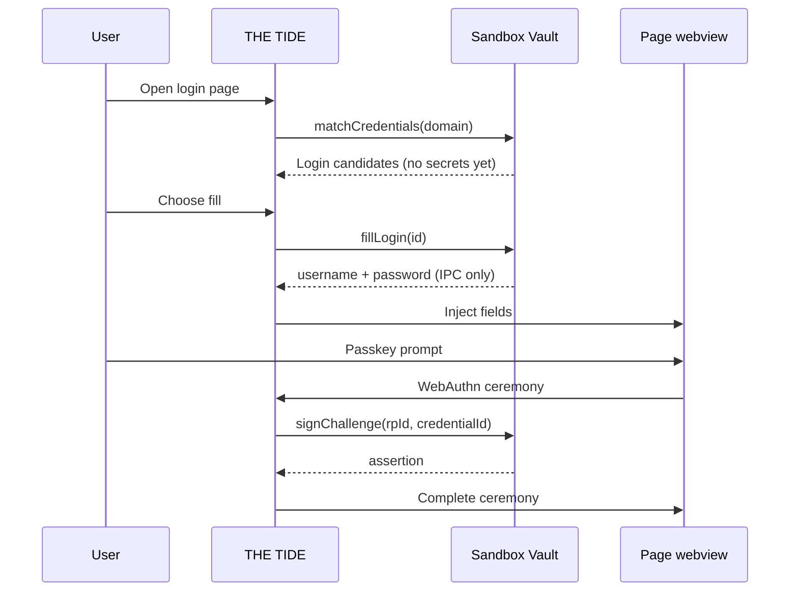

# Sandbox Vault — password manager spec

**Last updated:** 2026-07-12  
**Status:** Architecture only — no implementation  
**Stations doc:** [STATIONS-ARCHITECTURE.md](../sandbox-os-core/docs/STATIONS-ARCHITECTURE.md) (Sandbox Vault section)

## Purpose

Household-owned credential vault for Sandbox OS: website logins, passkeys, TOTP, and secure notes. **E2E encrypted**, synced via **tier34**, consumed by **THE TIDE** through an autofill/passkey bridge — not stored inside the browser or Music locker.

**Not in scope here:** payment rail / marketplace escrow (see [MARKETPLACE.md](./MARKETPLACE.md), [PHASES.md](./PHASES.md)).

---

## Data model

All items live in one **vault blob** encrypted with a key derived from the user master secret (OS identity + vault unlock). tier34 stores `{ ciphertext, version, deviceId, updatedAt }` only.

### Item types

| Type | Fields (plaintext inside blob) | Notes |
|------|--------------------------------|-------|
| **Login** | `id`, `title`, `uris[]`, `username`, `password`, `notes?`, `createdAt`, `updatedAt` | Match by registrable domain + optional path prefix |
| **Passkey** | `id`, `rpId`, `credentialId`, `privateKey` (COSE), `userHandle?`, `counter`, `displayName?` | WebAuthn credentials; Tide proxies ceremonies |
| **TOTP** | `id`, `issuer`, `account`, `secret` (base32), `digits`, `period`, `linkedLoginId?` | 2FA codes; optional link to Login |
| **SecureNote** | `id`, `title`, `body`, `tags[]?` | Freeform secrets (Wi‑Fi, recovery codes) |

### Vault envelope (sync)

```text
VaultBlob {
  schemaVersion: 1,
  kdf: "argon2id" | "scrypt",
  kdfParams: { ... },
  wrappedVaultKey: bytes,      // master unlock wraps data key
  items: [ Login | Passkey | TOTP | SecureNote ],
  tombstones: [ itemId ],      // sync deletes
  revision: uint64             // last-write-wins + CRDT later if needed
}
```

**Migration:** Existing tier34 `device-secrets.json` (addon API keys) remains separate in v0; credential items must never land in plaintext JSON. Optional v0 import path copies API keys into SecureNote or a dedicated `ApiKey` subtype later.

---

## Phases

### v0 — Encrypted blob + tier34 sync

- Local encrypted store (file or Stronghold) on one desktop device.
- New tier34 route or extended secrets API: **upload/download ciphertext blob** only.
- Manual Vault UI: unlock, add/edit Login, generate password, copy TOTP.
- **No Tide autofill yet** — copy/paste workflow.
- Deprecate putting website passwords in device-secrets or Jellyfin-style local prefs.

### v1 — OS station + mobile + Tide read-only bridge

- **Vault station** in launcher (`sandbox-vault`): search, folders/tags, breach-hardening (password strength audit).
- **Mobile:** same vault format; Capacitor plugin unlock + TOTP widget.
- **Tide bridge (read):** domain match → suggest login; user confirms fill (username/password fields).
- Household: multiple devices merge blob on unlock; tier34 holds no decrypt capability.

### v2 — Passkeys + full autofill + duress

- **WebAuthn / passkey** create + assert via Tide native webviews → Vault holds keys.
- Autofill without per-field confirm for trusted domains (user setting).
- **Duress PIN:** second PIN opens decoy vault slice or triggers key wipe ([THREAT-MODEL-TARGETED.md](./THREAT-MODEL-TARGETED.md)).
- Import/export (Bitwarden CSV, 1Password); optional shared household vault ACLs.

---

## Integration with THE TIDE



| Tide milestone | Vault dependency |
|----------------|------------------|
| iframe research browser (today) | None — no safe autofill |
| Native webview tabs ([STATIONS-ARCHITECTURE.md](../sandbox-os-core/docs/STATIONS-ARCHITECTURE.md)) | v1 fill bridge |
| `sandbox-browser` OS mode | v1–v2 passkeys |

**Contract:** Tide never persists credentials in `localStorage` or iframe storage. All secret material stays in Vault process / enclave.

---

## Related docs

- [STATIONS-ARCHITECTURE.md](../sandbox-os-core/docs/STATIONS-ARCHITECTURE.md) — station placement, vs Proton Pass
- [THREAT-MODEL-TARGETED.md](./THREAT-MODEL-TARGETED.md) — duress PIN, enclave keys
- [TIER34-EXTRACTION.md](../sandbox-os-core/docs/TIER34-EXTRACTION.md) — device-secrets module today
- [CONDUIT-LINK.md](./CONDUIT-LINK.md) — Tide / Builder context (not credential store)
